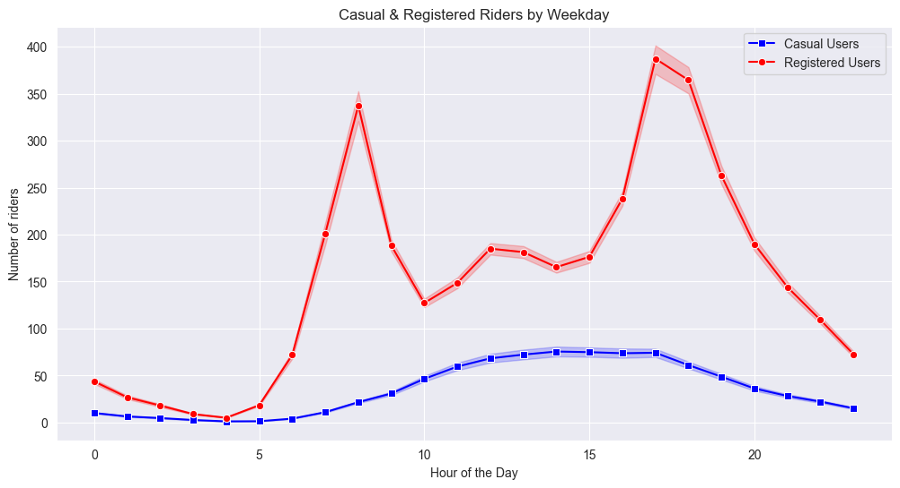

# Urban Mobility & Bike Demand: A Deep Dive EDA

## Project Overview
This project is my first properly documented Exploratory Data Analysis (EDA). Leveraging the UC Irvine Bike Sharing Dataset, I explored how environmental factors, temporal patterns, and user types (Casual vs. Registered) influence the demand for urban cycling.

Following an existing analytical framework from a Medium article, I used it as a baseline to build my own workflow. I focused on refining the data processing, specifically denormalizing variables for better interpretability and experimenting with categorical binning to see how these adjustments impact the clarity of the final trends.

## Technical Stack & Workflow
- **Environment**: Jupyter Notebook 
- **Libraries**: `Pandas`, `NumPy`, `Seaborn`, and `Matplotlib`.

### Key Techniques Mastered:
- **Data Denormalization:** Reversing Min-Max scaling to restore actual Celsius, Humidity, and Windspeed units.
- **Advanced Binning:** Precise use of `pd.cut` with `include_lowest=True` and `right=False` to handle edge-case data points (like 0.0 windspeed and cnt of 1 returning NaN).
- **Vectorized Operations:** Efficiently transforming 17,000+ rows.
- **Aggregation**: Using `.groupby(observed=True)` and `.reset_index()` to structure data for visualization.

## Key Insights & Findings

### 1. Analysis of Peak Hours (The M-Curve)

One of the most striking findings was the M-shaped demand curve for registered users.
- **The Peak**: Massive spikes occur at around 8:00 AM and 5:00 PM, clearly indicating that bicycles are a primary commuting tool in this region.
- **Cultural Contrast:** Coming from a background where cycling is often viewed as a leisure activity, seeing it as a structured, high-volume transport method for professionals was a significant "aha!" moment for me.

### 2. Temperature and Seasonality 
Contrary to the idea that people avoid physical activity in the heat, the data showed a strong positive correlation (~0.4) between temperature (`temp`/`atemp`) and rental counts. Demand peaks during the Summer. People are more likely to hop on a bike when it’s hot than when it’s even slightly chilly.

### 3. Humidity vs. Windspeed
While people don't mind the heat, they hate the stickiness. High humidity showed a clear negative impact on ridership, whereas windspeed had very little effect on demand than I initially expected.

## Lessons Learned
This project provided the "skeleton" I needed for a professional EDA workflow. Beyond the charts, I learned the importance of **Data Integrity**:

- **Edge Case Handling:** Solving the "NaN" issue by mastering interval boundaries in `pd.cut`. Understanding when to use `right=True` or `right=False`, and `include_lowest`.
- **State Management:** The importance of `inplace=True` vs. variable reassignment for memory management when using the `drop()` function.
- **Math Logic:** Revisiting the formula for min-max scaling in order to carry out denormalization correctly.

## Reference
This analysis was inspired by and built upon a foundational approach shared in this [Medium article](https://medium.com/@anitamontoyamm/bike-sharing-dataset-analysis-in-python-d63be3042410). 